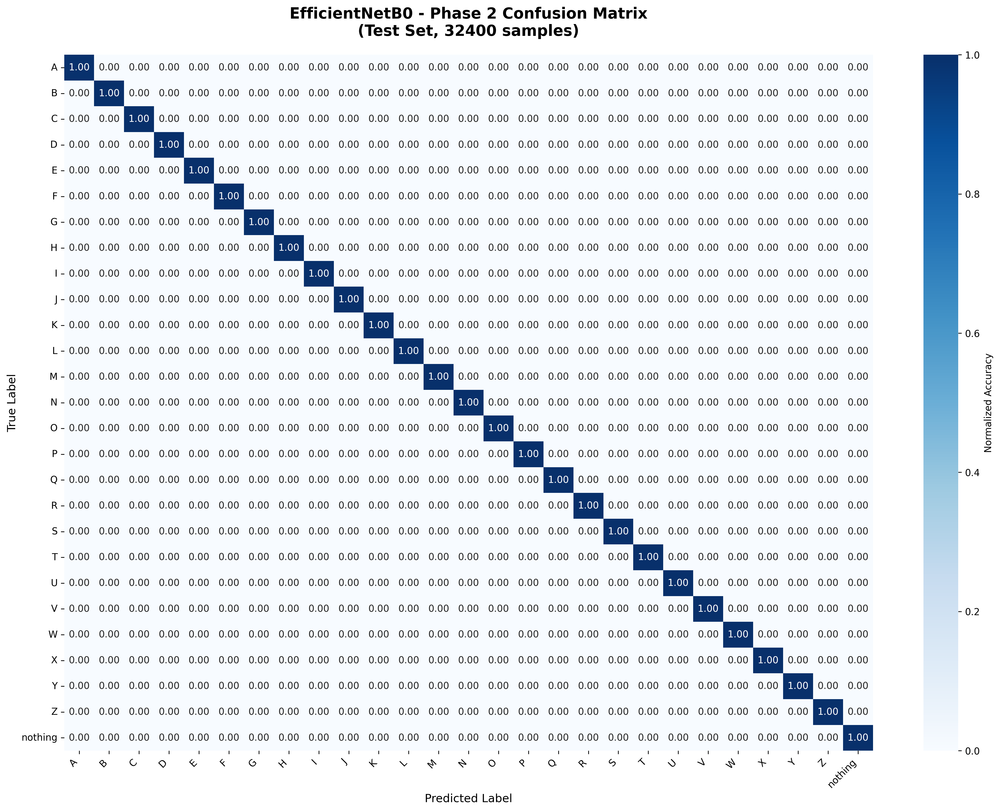

# ASL Recognition System

A comprehensive deep learning-based American Sign Language (ASL) recognition system with real-time hand detection, transfer learning, and model explainability features.

## 🎯 Features

### Core Capabilities
- **Real-Time Recognition**: Live ASL sign recognition using webcam with advanced hand detection
- **Single Image Prediction**: Upload and classify individual ASL sign images
- **Batch Folder Testing**: Test multiple images with automatic accuracy calculation
- **Grad-CAM Visualization**: Visualize model attention and decision-making process
- **Multiple Model Support**: Pre-trained models including EfficientNetB0, ResNet50, and InceptionV3

### Advanced Features
- **MediaPipe Integration**: Advanced hand landmark detection and skeleton visualization
- **Transfer Learning**: Optimized 2-phase training strategy (frozen base + fine-tuning)
- **Model Evaluation**: Comprehensive evaluation metrics with confusion matrices
- **Interactive GUI**: User-friendly interface with real-time feedback

## 📋 Table of Contents

- [Installation](#installation)
- [Project Structure](#project-structure)
- [Usage](#usage)
- [Training](#training)
- [Model Architecture](#model-architecture)
- [Configuration](#configuration)
- [Results](#results)
- [Team Collaboration](#team-collaboration)
- [Contributing](#contributing)
- [License](#license)

## 🚀 Installation

### Prerequisites

- Python 3.8+
- CUDA-capable GPU (recommended) or CPU
- Webcam (for real-time detection)

### Setup

1. **Clone the repository**
   ```bash
   git clone <repository-url>
   cd asl_project
   ```

2. **Create virtual environment**
   ```bash
   python -m venv venv
   
   # Windows
   venv\Scripts\activate
   
   # Linux/Mac
   source venv/bin/activate
   ```

3. **Install dependencies**
   ```bash
   pip install tensorflow>=2.10.0
   pip install opencv-python
   pip install mediapipe
   pip install pillow
   pip install numpy
   pip install matplotlib
   pip install seaborn
   pip install pandas
   pip install scikit-learn
   ```

## 📁 Project Structure

```
asl_project/
├── src/
│   ├── config.py              # Configuration settings
│   ├── data_preprocessing.py  # Data preprocessing and augmentation
│   ├── model_builder.py       # Model architecture definitions
│   ├── training.py            # Training pipeline
│   ├── evaluation.py          # Model evaluation utilities
│   ├── gui_light.py          # Main GUI application
│   └── utils.py              # Utility functions
├── data/
│   ├── raw/                  # Raw dataset
│   ├── processed/            # Processed train/val/test splits
│   └── real_world_test/      # Real-world test images
├── models/
│   ├── saved_models/         # Trained model weights
│   └── training_logs/        # Training history logs
└── docs/                     # Documentation and results
```

## 💻 Usage

### GUI Application

Launch the interactive GUI:

```bash
python src/gui_light.py
```

#### GUI Features:

1. **Load Model Weights**
   - Click "Load Weights" and select your trained model (.h5 file)
   - Choose model architecture: EfficientNetB0, ResNet50, or InceptionV3

2. **Real-Time Detection**
   - Click "Start Camera" to begin live recognition
   - Show ASL signs to your webcam
   - Hand skeleton overlay appears when hand is detected
   - Predictions display in real-time

3. **Single Image Prediction**
   - Click "Upload Image" to select an image file
   - View prediction, confidence, and top-3 predictions
   - Use "Run Grad-CAM" to visualize model attention

4. **Folder Testing**
   - Click "Upload Folder" to test multiple images
   - Choose ground truth source (folder name or filename)
   - View accuracy statistics and detailed results

5. **Grad-CAM Visualization**
   - Load an image first
   - Click "Run Grad-CAM" to toggle visualization
   - Green button = ON, Red button = OFF

### Command Line Training

Train a model from scratch:

```bash
python src/training.py
```

Follow the interactive prompts to:
- Select a model architecture
- Choose single model or batch training
- Monitor training progress

## 🎓 Training

### Training Strategy

The system uses a **2-phase transfer learning approach**:

1. **Phase 1**: Feature Extraction
   - Base model frozen (ImageNet weights)
   - Only train custom classification head
   - Learning rate: 0.001
   - Max epochs: 20

2. **Phase 2**: Fine-Tuning
   - Unfreeze top layers of base model
   - Fine-tune with lower learning rate: 0.0001
   - Max epochs: 15

### Data Preparation

1. **Preprocess dataset**:
   ```bash
   python src/data_preprocessing.py
   ```

   This will:
   - Split data into train/val/test (70/15/15)
   - Apply data augmentation
   - Generate class indices and weights
   - Create data generators

### Training Configuration

Edit `src/config.py` to customize:
- Batch size
- Learning rates
- Epochs per phase
- Data augmentation parameters
- Model architectures

## 🏗️ Model Architecture

### Supported Models

- **EfficientNetB0**: Efficient and accurate, good for resource-constrained environments
- **ResNet50**: Robust feature extraction, proven performance
- **InceptionV3**: Multi-scale feature learning

### Architecture Details

All models follow this structure:
```
Input (224x224x3)
    ↓
Pre-trained Base Model (frozen in Phase 1)
    ↓
Global Average Pooling
    ↓
Dense(512) + BatchNorm + Dropout(0.5)
    ↓
Dense(27) + Softmax
```

### Classes

The model recognizes **27 ASL classes**:
- Letters A-Z (26 classes)
- Special signs:"nothing"

## ⚙️ Configuration

Key settings in `src/config.py`:

```python
IMG_SIZE = 224              # Input image size
BATCH_SIZE = 32             # Training batch size
NUM_CLASSES = 27            # Number of ASL classes
INITIAL_LR_PHASE1 = 0.001   # Phase 1 learning rate
INITIAL_LR_PHASE2 = 0.0001  # Phase 2 learning rate
MAX_EPOCHS_PHASE1 = 20      # Phase 1 max epochs
MAX_EPOCHS_PHASE2 = 15      # Phase 2 max epochs
```

## 📊 Results

### 🏆 Model Comparison Summary

All three models achieved exceptional performance (>99.8%) after Phase 2 fine-tuning. **EfficientNetB0** performed the best overall.

| Model | Accuracy | Precision | Recall | F1-Score |
| :--- | :--- | :--- | :--- | :--- |
| **EfficientNetB0** | **99.92%** | **99.92%** | **99.92%** | **99.92%** |
| **InceptionV3** | 99.89% | 99.89% | 99.89% | 99.89% |
| **ResNet50** | 99.80% | 99.80% | 99.80% | 99.80% |

---

### 🥇 EfficientNetB0 (Best Model)

| Metric | Score |
| :--- | :--- |
| **Accuracy** | **99.92%** |
| **Test Samples** | 32,400 |
| **Misclassified** | 26 |

#### Confusion Matrix


---

### 🥈 InceptionV3

| Metric | Score |
| :--- | :--- |
| **Accuracy** | **99.89%** |
| **Test Samples** | 32,400 |
| **Misclassified** | 35 |

#### Confusion Matrix


---

### 🥉 ResNet50

| Metric | Score |
| :--- | :--- |
| **Accuracy** | **99.80%** |
| **Test Samples** | 32,400 |
| **Misclassified** | 65 |

#### Confusion Matrix


---

### 📈 Comparison Visualizations

#### Model Performance Comparison


#### Performance Radar Chart


#### Class-wise Performance
All models achieve near-perfect classification numbers across all 27 classes. EfficientNetB0 demonstrates the highest consistency with only 26 misclassified samples out of 32,400.

## 🔧 Advanced Features

### Real-Time Hand Detection

- **MediaPipe Integration**: Advanced hand landmark detection
- **Hand Tracking**: Smooth bounding box prediction
- **Confidence Thresholding**: Filter low-confidence predictions
- **Skeleton Visualization**: Green hand skeleton overlay

### Grad-CAM Visualization

- Visualize which parts of the image the model focuses on
- Toggle on/off with button click
- Heatmap overlay on original image
- Helps understand model decisions

### Batch Testing

- Test entire folders of images
- Automatic accuracy calculation
- Support for folder-name or filename-based ground truth
- Detailed per-image results logging

## 🐛 Troubleshooting

### Common Issues

1. **Camera not detected**
   - Check camera permissions
   - Try different camera indices in code
   - Ensure no other application is using the camera

2. **MediaPipe errors**
   - Install compatible protobuf: `pip install "protobuf==3.20.*"`
   - Reinstall mediapipe: `pip install mediapipe==0.10.11`

3. **GPU memory errors**
   - Reduce batch size in `config.py`
   - Use smaller model (EfficientNetB0)
   - Enable memory growth (already configured)

4. **Model loading errors**
   - Ensure model architecture matches selected type
   - Check that weights file exists and is complete
   - Verify class indices file exists

## 📝 Requirements

### Core Dependencies

```
tensorflow>=2.10.0
opencv-python>=4.5.0
mediapipe>=0.10.0
pillow>=8.0.0
numpy>=1.21.0
matplotlib>=3.5.0
seaborn>=0.11.0
pandas>=1.3.0
scikit-learn>=1.0.0
```

### Optional Dependencies

- CUDA Toolkit (for GPU acceleration)
- cuDNN (for GPU acceleration)

## Team Collaboration

This project is designed for collaborative development with 5 team members, each responsible for a specific component:

### Team Member Responsibilities

#### 👥 `Shehab Hossam`: GUI Developer
**Responsibility**: `src/gui_light.py`
- Develop and maintain the graphical user interface
- Implement real-time camera feed and hand detection visualization
- Add new GUI features and improve user experience
- Handle user interactions and event management
- Integrate with other modules (model loading, prediction, Grad-CAM)
- Handle real-world testing scenarios

**Key Files**:
- `src/gui_light.py` - Main GUI application
- GUI-related utilities and helpers

**Skills Required**: Python, Tkinter, OpenCV, GUI design

---

#### 👥 `Joseph Wafiq`: Documentation Specialist
**Responsibility**: Documentation and README
- Maintain and update `README.md`
- Write code documentation and docstrings
- Create user guides and tutorials
- Document API usage and examples
- Maintain changelog and version history
- Create visual diagrams and flowcharts

**Key Files**:
- `README.md` - Main project documentation
- `docs/` - Additional documentation
- Code comments and docstrings

**Skills Required**: Technical writing, Markdown, documentation tools

---

#### 👥 `Omar Khaled`: Data Preprocessing Engineer
**Responsibility**: `src/data_preprocessing.py`
- Implement data loading and preprocessing pipelines
- Design and optimize data augmentation strategies
- Handle dataset splitting (train/val/test)
- Manage class indices and weights
- Optimize data generators for performance
- Handle different image formats and sizes

**Key Files**:
- `src/data_preprocessing.py` - Data preprocessing module
- `src/utils.py` - Utility functions for data handling

**Skills Required**: Python, NumPy, OpenCV, data engineering

---

#### 👥 `Abdelrahan Ezzat`: GitHub Repository Manager
**Responsibility**: Repository management and version control and `src/evaluation.py`
- Implement model evaluation metrics
- Create confusion matrices and classification reports
- Design test suites and validation procedures
- Generate performance visualizations
- Compare model performances
- Manage GitHub repository structure
- Handle pull requests and code reviews
- Maintain `.gitignore` and repository settings
- Organize issues and project boards
- Manage releases and tags
- Set up CI/CD pipelines (optional)
- Coordinate merges and resolve conflicts

**Key Files**:
- `src/evaluation.py` - Evaluation module
- `.gitignore`
- GitHub Actions workflows (if any)
- Repository settings and documentation

**Skills Required**: Git, GitHub, version control, project management

---

#### 👑 `Saeed Nadim`: Evaluation & Testing Specialist & Model Architect & Training Engineer
**Responsibility**: `src/evaluation.py` and `src/model_builder.py` and `src/training.py`
- Design and implement model architectures
- Optimize transfer learning strategies
- Manage training pipelines and hyperparameters
- Implement callbacks and training optimizations
- Monitor training progress and metrics
- Save and load model weights

**Key Files**: 
- `src/model_builder.py` - Model architecture definitions
- `src/training.py` - Training pipeline
- `src/config.py` - Configuration settings

**Skills Required**: Python, scikit-learn, matplotlib, statistical analysis, Deep Learning, TensorFlow/Keras, transfer learning, hyperparameter tuning

---

### Collaboration Workflow

1. **Initial Setup**:
   ```bash
   # Each member clones the repository
   git clone <repository-url>
   cd asl_project
   ```

2. **Branch Strategy**:
   ```bash
   # Each member works on their own feature branch
   git checkout -b feature/gui-improvements      # Shehab Hossam
   git checkout -b feature/documentation-update   # Joseph Wafiq
   git checkout -b feature/data-preprocessing     # Omar Khaled
   git checkout -b feature/repo-management       # Abdelrahman Ezzat
   git checkout -b feature/evaluation-metrics    # Abdelrahman Ezzat
   git checkout -b feature/model-training        # Saeed Nadim
   ```

3. **Communication**:
   - Use GitHub Issues for task tracking
   - Create pull requests for code review
   - Regular team meetings to sync progress
   - Document API changes for integration

4. **Integration Points**:
   - **GUI ↔ Model**: GUI loads models built by Member 6
   - **GUI ↔ Data**: GUI uses preprocessing from Member 3
   - **Training ↔ Evaluation**: Member 6 trains, Member 5 evaluates
   - **All ↔ Documentation**: Member 2 documents all changes

5. **Testing Before Merge**:
   - Each member tests their component independently
   - Integration testing before merging to main
   - Member 5 validates overall system performance

## 🤝 Contributing

Contributions are welcome! Please feel free to submit a Pull Request.

### Development Guidelines

1. Follow PEP 8 style guidelines
2. Add docstrings to new functions
3. Update README for new features
4. Test changes thoroughly
5. Coordinate with team members for integration
6. Update documentation when making API changes

## 📄 License

This project is licensed under the `Helwan National University`

## 🙏 Acknowledgments

- [ASL Alphabet Dataset](https://www.kaggle.com/datasets/grassknoted/asl-alphabet)
- TensorFlow/Keras team
- MediaPipe team
- OpenCV community

## 📧 Contact

For questions or issues,Send Me:`nadimsaed61@gmail.com`

---

**Note**: This project is optimized for RTX 3060 6GB GPU but works on CPU as well (slower performance).

